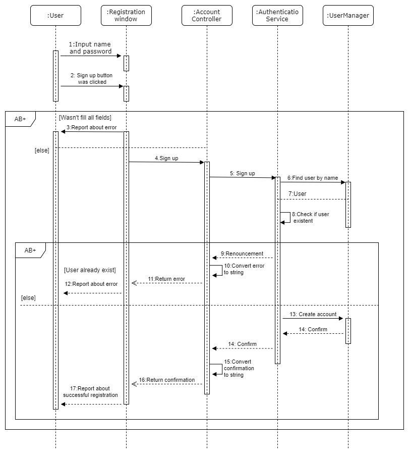
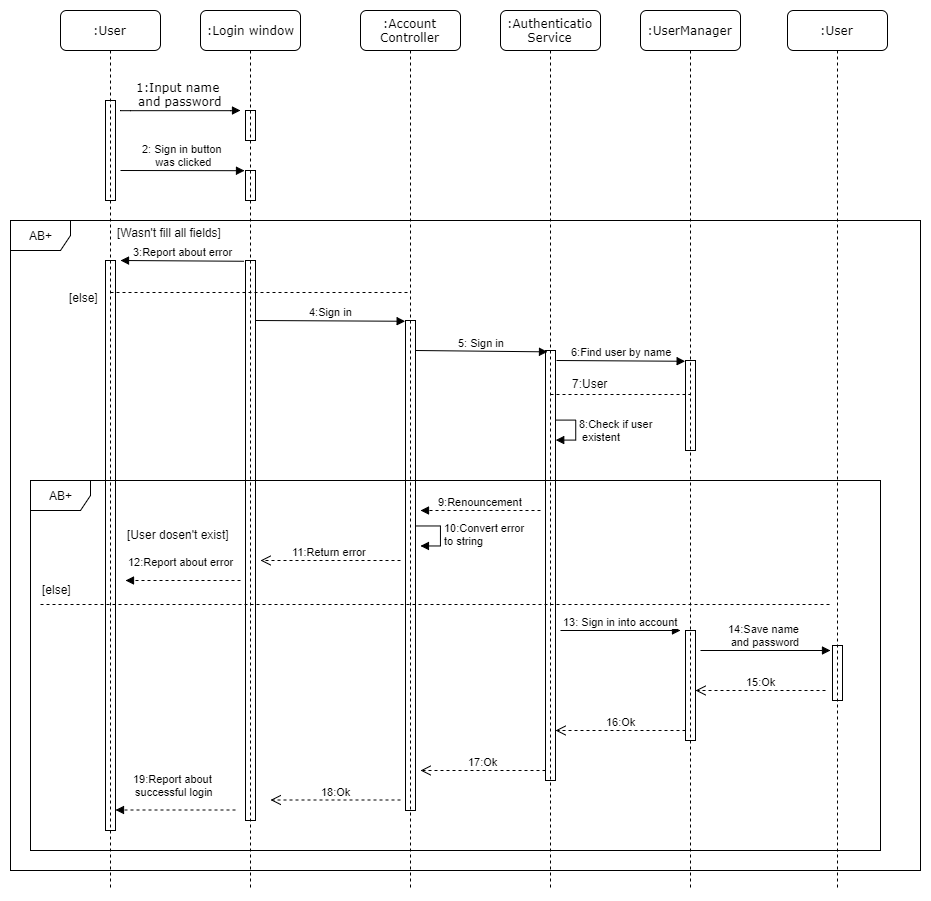
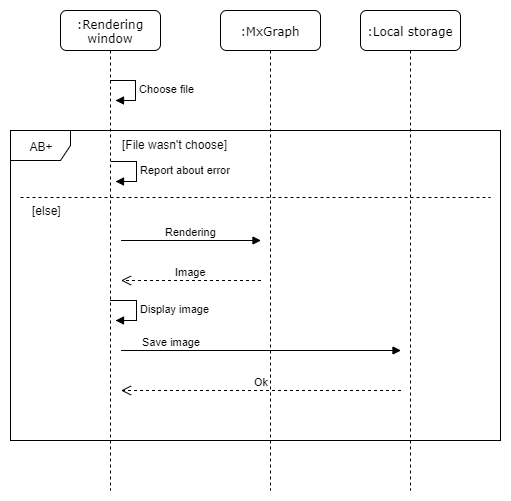
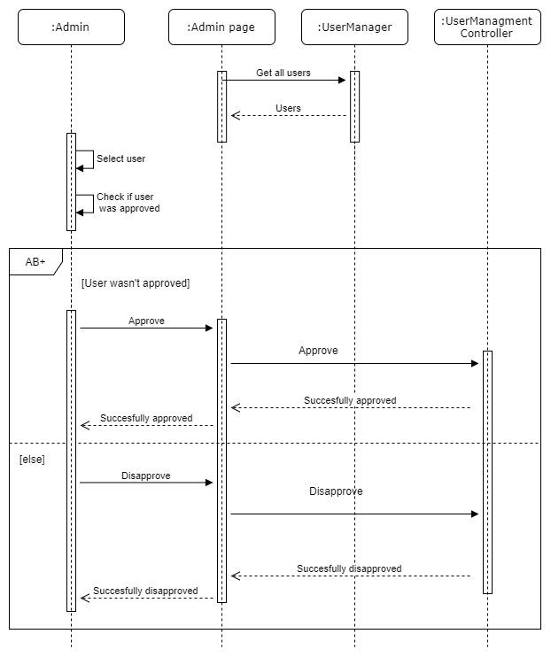

# Диаграммы последовательностей
---

# Содержание
1 [Зарегистрироваться](#reg)  
2 [Войти в учётную запись](#login)  
3 [Рендеринг диаграмм](#ren)  
4 [Настройка прав пользователей](#config)

<a name="reg"/>

# 1 Зарегистрироваться

<a name="login"/>

# 2 Войти в учётную запись

<a name="ren"/>

# 3 Рендеринг диаграмм

<a name="config"/>

# 4 Настройка прав пользователей

