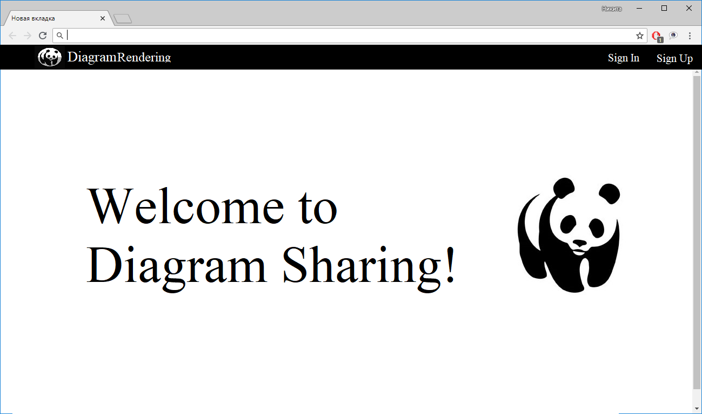
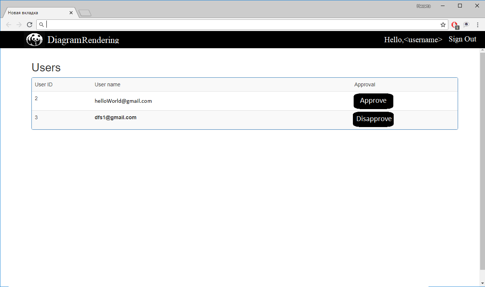
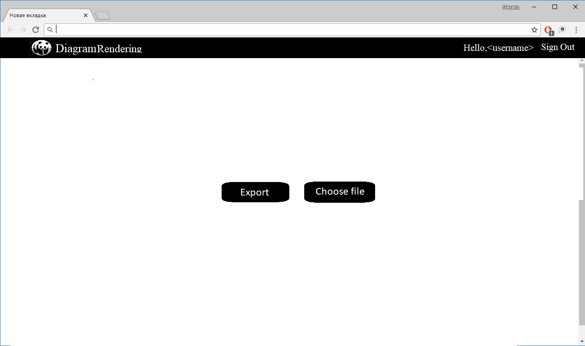

# Требования

## Требования пользователя

### Программные интерфейсы

- Должна быть возможность отображения диаграммы в браузере.
- Должен быть реализован рендеринг диаграммы, которую генерирует библиотека mxGraph в изображение формата png.

### Интерфейс пользователя

- Главный экран приложения
  
- Страница для управления пользователями
  
- Страница для рендеринга
  

### Характеристики пользователей

DiagramRendering хорошо подойдет для людей работающих над созданием различных диаграмм. Интерфейс и идея программы достаточно просты и привычны для среднего Интернет-пользователя.

## Системные требования:

#### Действия пользователей

Зарегестрированные пользователи должны иметь возможность:

- Генерировать из xml файла, содержащего диаграмму, изображение формата png.
- Отображать полученную диагрммы в браузере.
- Сохранять изображение на локальный диск компьютера. 

#### Управление пользователями

- Доступ к управлению правами пользователя доступен только администратору. 

- При настройке прав пользователя должны быть доступны следующие настройки:

  - Approval/Disapproval

- Администратор должен иметь возможность апрувнуть пользователя (разрешить рендерить диаграммы)

- На странице для рендеринга должна быть :
  - Изображение
  - Кнопка скачать изображение

## Нефункциональные требования

* Приложение должно быть разбито на две независимо работающие части — серверную и клиентскую. Серверная часть должна быть релизована на языке C# с использованием фреймворка **ASP.NET MVC**; клиентская часть должна быть реализована на языке javascript. Взаимодействие клиентской части с серверной должно вестись только через публичный API. 
* Наличие валидации корректности почтового адреса. 
* Серверная часть приложения должна производить отслеживание и логирование ошибок. 
* Интерфейс пользователя должен быть выполнен в темных (желательно черных) тонах, потому что черный — строгий и формальный цвет.
* Валидация данных - за валидацию в приложении будет отвечать библиотека ASP .NET Identity, позволяющая организовать надежную работу с пользователем.

## Аналоги

Основное отличие от большинства аналогов -- способ предоставления сервиса. DiagramSharing является веб-приложением, это значительно упрощает процесс использования. 
Все перечисленные аналоги требуют предварительной установки и настройки.

- https://www.onlinecharts.ru/
  - Мало возможностей
- https://www.chartblocks.com/
  - Платный