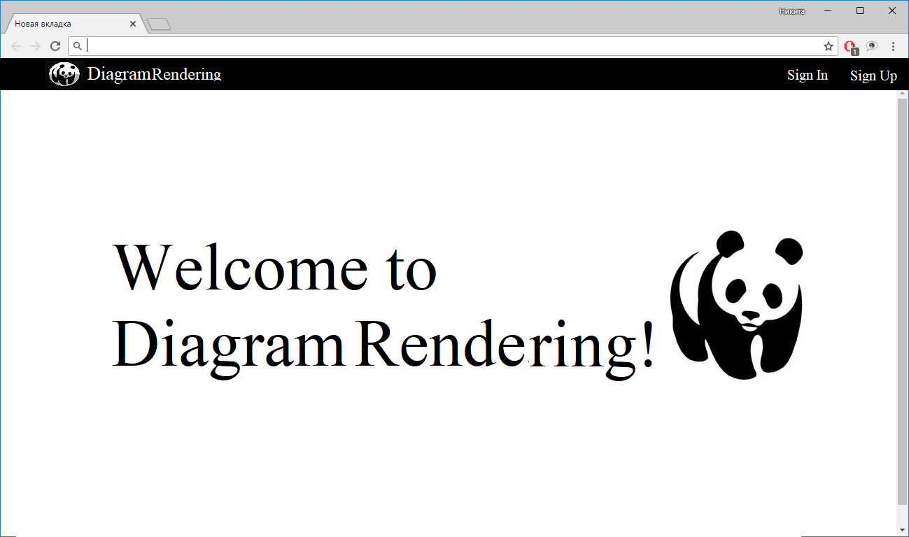

# Требования к проекту
---
# Содержание

# 1 Введение

## 1.1 Назначение

 В этом документе описаны функциональные и нефункциональные требования к веб-приложению «DiagramRendering» для Google Chrome. Этот документ предназначен для команды, которая будет реализовывать и проверять корректность работы приложения.

## 1.2 Бизнес-требования

<a name="initial_data"/>

### 1.2.1 Исходные данные

В современном мире много людей работает с различного рода диаграммами и сервисами, которые предоставляют возможности работы с ними
Однако, не все из них предосталяют информацию в нужном для пользователя виде. Это приводит к тому, что пользователи ищут сторонние сервисы для получение желаемого результата. 

<a name="business_opportunities"/>

### 1.2.2 Возможности бизнеса

Многие преподоавтели, архитекторы желают иметь приложение, которое позволит получать диаграммы в png формате. Подобное приложение позволит им тратить меньше времени на получение необходимого изображения. Интерфейс, спроектированный с учётом того что он должен быть простым, чтобы была возможность работать людям с малой технической грамотностью.

## 1.3 Аналоги

Основное отличие от большинства аналогов -- способ предоставления сервиса. DiagramRendering является веб-приложением, это значительно упрощает процесс использования. 
Все перечисленные аналоги требуют предварительной установки и настройки.

- https://www.onlinecharts.ru/
  - Отсутсвие возможности генерировать диаграммы по уже существующему xml файлу.
- https://www.chartblocks.com/
  - Реклама
  - Отсутсвие возможности генерировать диаграммы по уже существующему xml файлу.

## Требования пользователя

### Программные интерфейсы

- Должна быть возможность отображения диаграммы в браузере.
- Должен быть реализован рендеринг диаграммы, которую генерирует библиотека mxGraph в изображение формата png.

### Интерфейс пользователя

- Главный экран приложения
  
- Страница для управления пользователями
  
- Страница для рендеринга
  

### Характеристики пользователей

<a name="user_classes"/>

### 2.3.1 Классы пользователей

| Класс пользователей | Описание |
|:---|:---|
| Анонимные пользователи | Пользователи, которые не хотят регистрироваться в приложении.Не имеют доступ к функционалу |
| Зарегистрированные пользователи | Пользователи, которые вошли в приложение под своим именем (псевдонимом), желающие рендерить диаграммы, выбранные ими. Имеют доступ к частичному функционалу |
| Администраторы | Пользователи, которые вошли в приложение под своим именем (псевдонимом) и имеющие, возможность не только рендерить диаграммы,но и активировать пользователей. Имеют доступ к полному функционалу |

DiagramRendering хорошо подойдет для 

- Архитекторов
- Преподавателей
- Менеджеров

### 2.3.2 Аудитория приложения

<a name="target_audience"/>

#### 2.3.2.1 Целевая аудитория

 Люди со средним или выше среднего уровнем образования,например, архитекторы, преподаватели, менеджеры, обладающие минимальной технической грамотностью.

<a name="collateral_audience"/>

#### 2.3.2.2 Побочная аудитория
Все остальные люди, обладающие вышеперечисленными качествами.

<a name="assumptions_and_dependencies"/>

## 2.4 Предположения и зависимости
1. Приложение не работает при отсутствии подключения к Интернету;
2. Приложение не обрабатывает файлы xml не сгенерированные библиотекой mxGraph.

<a name="system_requirements"/>

# 3 Системные требования

<a name="functional_requirements"/>

## 3.1 Функциональные требования

<a name="main_functions"/>

### 3.1.1 Основные функции

<a name="user_logon_to_the_application"/>

#### 3.1.1.1 Вход пользователя в приложение
**Описание.** Пользователь имеет возможность использовать приложение без создания собственного профиля либо войдя в свою учётную запись.

| Функция | Требования | 
|:---|:---|
| Вход в приложение без создания собственного профиля | Приложение должно предоставить пользователю возможность войти в приложение анонимно |
| <a name="registration_requirements"/>Регистрация нового пользователя | Приложение должно запросить у пользователя ввести имя для создания учётной записи. Пользователь должен либо ввести имя, либо отменить действие |
| *Пользователь с таким именем существует* | *Приложение должно известить пользователя об ошибке регистрации и запросить ввод 

<a name="view_information_about_an_individual_newsletter"/>

#### 3.1.1.2 Активация аккаунта
**Описание.** Администратор имеет возможность активировать/деактивировать аккаунт.

| Функция | Требования | 
|:---|:---|
| Активация аккаунта|
| <a name="registration_requirements"/>Администратор должен активировать/деактивировать аккаунт | Пользователь должен зарегистрироваться и дождаться, пока администратор не активирует аккаунт |

<a name="view_information_about_an_individual_newsletter"/>

#### 3.1.1.3 Рендеринг диаграммы
**Описание.** Зарегистрированный пользователь имеет возможность рендерить диаграммы.

| Функция | Требования | 
|:---|:---|
| Рендеринг диагрммы | Пользователь имеет возможность выбрать файл из локального хранилища | Приложение должно отрендерить диграмму и отобразить ее в окне браузера |

<a name="view_information_about_an_individual_newsletter"/>

#### 3.1.1.4 Сохранение изображения
**Описание.** Пользователь имеет возможность сохранить изображение на локальный диск.

| Функция | Требования | 
|:---|:---|
| Сохранение изображения |
| <a name="registration_requirements"/>Пользователь должен иметь возможность сохранить полученную диаграмму в выбранную им дерикторию 

<a name="active_user_change"/>

#### 3.1.1.5 Выход зарегистрированного пользователя из учётной записи
**Описание.** Зарегистрированный пользователь имеет возможность выйти из учётной записи.

**Требование.** Приложение должно предоставить зарегистрированному пользователю возможность выйти из учётной записи с возвратом к окну входа в приложение.

<a name="add_new_user"/>

#### 3.1.1.6 Регистрация нового пользователя после входа в приложение
**Описание.** Анонимный пользователь имеет возможность зарегистрироваться в приложении.

**Требование.** Приложение должно предоставить анонимному пользователю возможность [зарегистрироваться в приложении](#registration_requirements). 

### 3.1.2 Ограничения и исключения
1. Приложение работает только при наличии подключения к Интернету;
2. Рендеринг осуществляется при наличии подходящего xml файла, сгенерированного при помощи библиотеки mxGraph.

<a name="non-functional_requirements"/>

## 3.2 Нефункциональные требования
<a name="quality_attributes"/>

### 3.2.1 Атрибуты качества

<a name="requirements_for_ease_of_use"/>

#### 3.2.1.1 Требования к удобству использования
1. Элементы должны быть свет;
2. Все функциональные элементы пользовательского интерфейса имеют названия, описывающие действие, которое произойдет при выборе элемента;
3. Пошаговая инструкция использования основных функций приложения отображена в справке;

<a name="security_requirements"/>

#### 3.2.1.2 Требования к безопасности
Приложение предоставляет возможность рендеринга и сохранения диаграммы только после активации администратором данного аккуаунта.

<a name="external_interfaces"/>

### 3.2.2 Внешние интерфейсы
Окна приложения удобны для использования пользователями с :
  * размер шрифта не менее 14пт;
  * функциональные элементы контрастны фону окна.

<a name="restrictions"/>

### 3.2.3 Ограничения
1. Приложение реализовано на платформе .NET Framework 4.7.2;
2. Профиль пользователя хранится в базе данных.